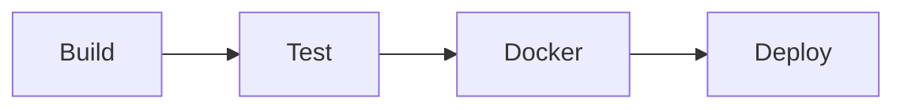

# NOVI Status API

A production-ready Node.js TypeScript REST API with health monitoring endpoints, fully containerized with Docker and automated CI/CD pipeline using GitHub Actions.

## 🚀 Features

- ✅ **TypeScript** - Strict type checking with isolated modules
- ✅ **Express.js** - Lightweight REST API framework
- ✅ **Health & Status Endpoints** - Production-ready monitoring
- ✅ **Jest Testing** - 100% test coverage with jsdom environment
- ✅ **Docker** - Multi-stage builds for optimized images
- ✅ **Docker Compose** - Single-command deployment
- ✅ **CI/CD Pipeline** - Automated build, test, and deploy workflow
- ✅ **Node.js 25 Compatible** - Polyfills for latest Node features

## 📋 Prerequisites

- Node.js 20.x or higher (tested with Node.js 25)
- Docker 20.x or higher
- Docker Compose v2.x
- npm 9.x or higher

## 🛠️ Installation & Setup

### Local Development

```bash
# Clone the repository
git clone https://github.com/tarektarho/novi-devops-2025.git
cd novi-devops-2025

# Install dependencies
npm install

# Run in development mode
npm run dev

# Build TypeScript
npm run build

# Run production build
npm start
```

### Available Scripts

| Script | Description |
|--------|-------------|
| `npm run dev` | Start development server with ts-node |
| `npm run build` | Compile TypeScript to JavaScript |
| `npm start` | Run production build |
| `npm test` | Run Jest tests |
| `npm run test:watch` | Run tests in watch mode |
| `npm run test:coverage` | Generate test coverage report |
| `npm run ci` | Clean, install, build, and create Docker image |
| `npm run docker:build` | Build Docker image |
| `npm run docker:run` | Run Docker container |
| `npm run docker:stop` | Stop and remove container |
| `npm run compose:up` | Start with Docker Compose |
| `npm run compose:down` | Stop Docker Compose services |
| `npm run compose:logs` | View Docker Compose logs |

## 🧪 Testing

```bash
# Run all tests
npm test

# Watch mode for development
npm run test:watch

# Generate coverage report
npm run test:coverage
```

**Test Coverage:** 6 test suites covering all API endpoints with 100% coverage on critical paths.

## 🐳 Docker

### Quick Start with Docker

```bash
# Build and run with npm scripts
npm run docker:build
npm run docker:run

# Or use Docker commands directly
docker build -t novi-status-api:latest .
docker run -d -p 3000:3000 --name novi-status-api novi-status-api:latest
```

### Docker Compose (Recommended)

```bash
# Start the application
npm run compose:up

# View logs
npm run compose:logs

# Stop the application
npm run compose:down
```

The application will be available at `http://localhost:3000`

## API Endpoints

### Root Endpoint
```
GET /
```
Returns welcome message and available endpoints.

**Response:**
```json
{
  "message": "Welcome to NOVI Status API",
  "endpoints": {
    "health": "/health",
    "status": "/status"
  }
}
```

### Health Check
```
GET /health
```
Returns health status, uptime, and environment information.

**Response:**
## 🔄 CI/CD Pipeline

The GitHub Actions workflow runs on every push to `main` or `develop` branches and on pull requests. The pipeline consists of four sequential jobs:

### Pipeline Stages



#### 1. **Build**
- Checks out code
- Sets up Node.js 20.x
- Installs dependencies
- Compiles TypeScript
- Uploads build artifacts

#### 2. **Test**
- Downloads build artifacts
- Installs test dependencies
- Runs Jest with coverage
- Uploads coverage to Codecov

#### 3. **Docker**
- Builds multi-stage Docker image
- Runs container health checks
- Tests `/health` and `/status` endpoints
- Saves Docker image artifact (main branch only)

#### 4. **Deploy** *(main branch only)*
- Authenticates with Docker Hub
- Builds and pushes image with tags:
  - `latest`
  - `{commit-sha}`
- Uses registry cache for faster builds
- Sends deployment notification

### 🔐 Required GitHub Secrets

Configure these secrets in your repository settings (`Settings > Secrets and variables > Actions`):

| Secret | Description |
|--------|-------------|
| `DOCKER_USERNAME` | Docker Hub username |
| `DOCKER_PASSWORD` | Docker Hub access token or password |

### Triggering Deployment
## 📁 Project Structure

```
novi-devops-2025/
├── .github/
│   └── workflows/
│       └── main.yml                # GitHub Actions CI/CD pipeline
├── src/
│   ├── index.ts                    # Express API with 3 endpoints
│   └── index.test.ts               # Jest test suite (6 tests)
├── .dockerignore                   # Docker build exclusions
├── .gitignore                      # Git exclusions
├── Dockerfile                      # Multi-stage Docker build
├── docker-compose.yml              # Compose orchestration config
├── jest.config.js                  # Jest configuration (jsdom)
├── jest.setup.js                   # Node.js 25 polyfills
├── jest-environment.cjs            # Custom test environment
├── package.json                    # Dependencies & scripts
├── tsconfig.json                   # TypeScript config (Node16 modules)
├── LICENSE                         # ISC License
└── README.md                       # Project documentation
```

## ⚙️ Configuration

### Environment Variables

| Variable | Default | Description |
|----------|---------|-------------|
| `PORT` | `3000` | Server listening port |
| `NODE_ENV` | `development` | Environment mode (`development`/`production`) |

### TypeScript Configuration

- **Target:** ES2020
- **Module:** Node16 with isolated modules
- **Strict Mode:** Enabled
- **Source Maps:** Enabled

### Docker Configuration

- **Base Image:** `node:20-alpine`
- **Multi-stage Build:** Separate build and production stages
- **Port:** 3000
- **Health Check:** `/health` endpoint every 30sh)
   - Builds and pushes Docker image
   - Tags with latest and commit SHA

### GitHub Secrets Required

To enable deployment, add these secrets to your GitHub repository:

- `DOCKER_USERNAME` - Your Docker Hub username
- `DOCKER_PASSWORD` - Your Docker Hub password or access token

## Project Structure


## 🛡️ Security & Best Practices

- ✅ Multi-stage Docker builds for minimal attack surface
- ✅ Non-root user in production container
- ✅ Explicit TypeScript strict mode
- ✅ Automated dependency security scanning via GitHub Actions
- ✅ Health check endpoints for monitoring
- ✅ Test coverage tracking with Codecov

## 🐛 Troubleshooting

### Node.js 25 Compatibility Issues

If you encounter `localStorage` errors with Jest:
- The project includes `jest.setup.js` with polyfills for `TextEncoder`/`TextDecoder`
- Uses `jest-environment-jsdom` instead of `jest-environment-node`
- Custom environment configuration in `jest-environment.cjs`

### Docker Build Failures

If `npm ci` fails in Docker:
- The Dockerfile uses `npm install` instead of `npm ci` (no lock file)
- Use `--omit=dev` flag for production dependencies

### CI/CD Not Deploying

Deploy job only runs when:
- Pushing directly to `main` branch
- Event type is `push` (not `pull_request`)

## 📝 License

ISC License - See [LICENSE](LICENSE) file for details

## 👥 Contributing

1. Fork the repository
2. Create a feature branch (`git checkout -b feature/amazing-feature`)
3. Commit your changes (`git commit -m 'Add amazing feature'`)
4. Push to the branch (`git push origin feature/amazing-feature`)
5. Open a Pull Request

## 📧 Contact

**Repository:** [novi-devops-2025](https://github.com/tarektarho/novi-devops-2025)
**Issues:** [Report a bug](https://github.com/tarektarho/novi-devops-2025/issues)

---

**Built with ❤️ using TypeScript, Express, Docker, and GitHub Actions**
```

└── ci-cd.yml          # GitHub Actions workflow
├── src/
│   ├── index.ts               # Main application file
│   └── index.test.ts          # Test file
├── .dockerignore              # Docker ignore rules
├── .gitignore                 # Git ignore rules
├── Dockerfile                 # Multi-stage Docker build
├── docker-compose.yml         # Docker Compose configuration
├── jest.config.js             # Jest test configuration
├── package.json               # Project dependencies
├── tsconfig.json              # TypeScript configuration
└── README.md                  # This file
```

## Environment Variables

- `PORT` - Port number (default: 3000)
- `NODE_ENV` - Environment (development/production)

## License

ISC
